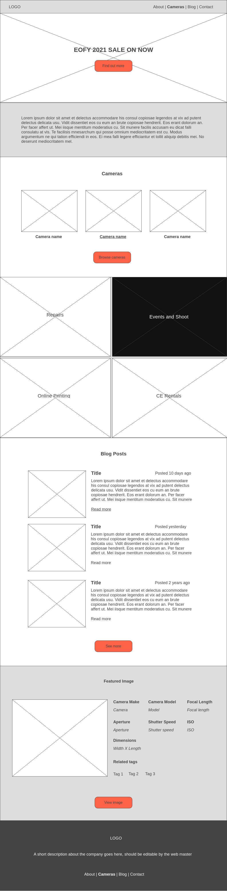
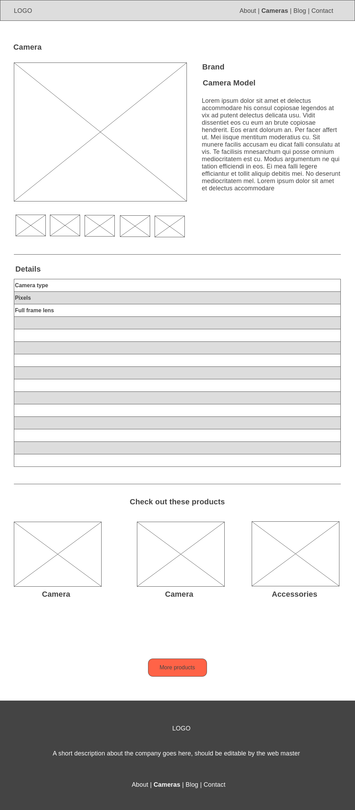
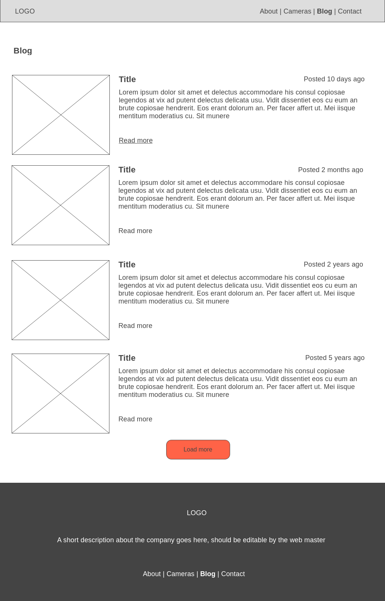
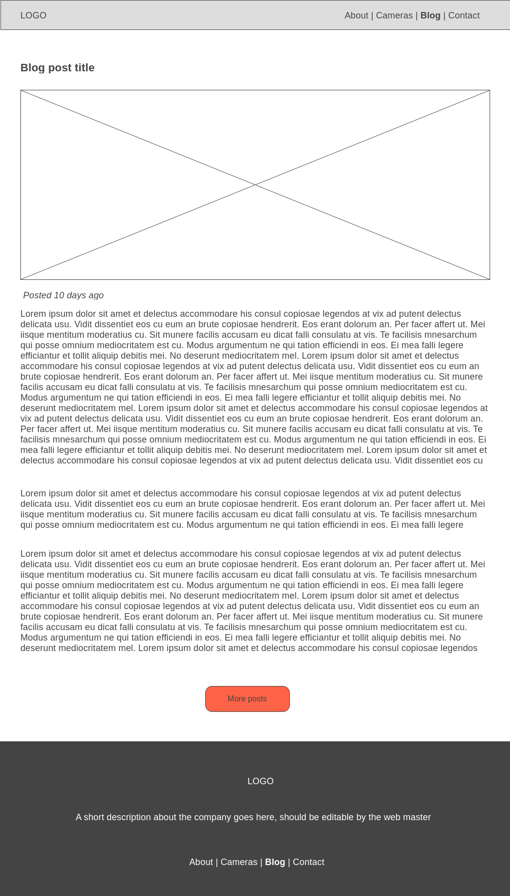
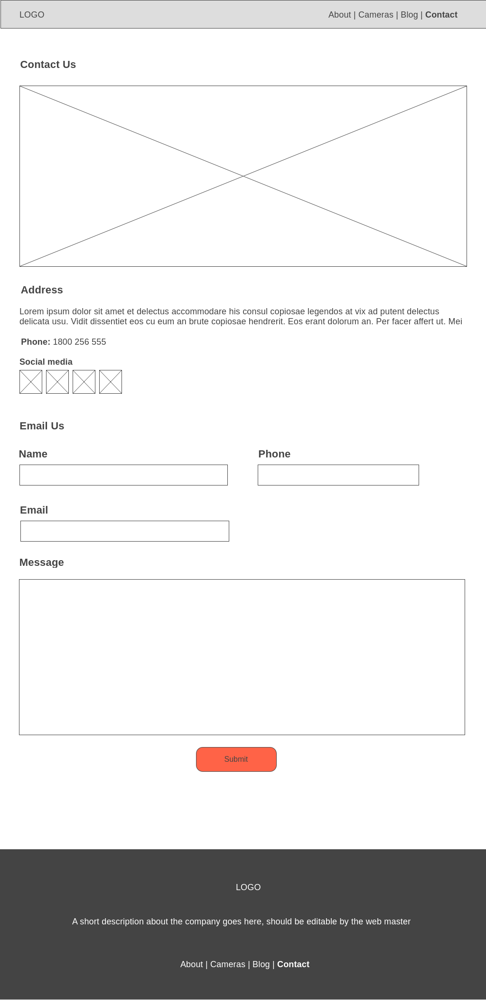

# Mock Project UI

The purpose of this repository is to aid individuals who wants to start a career in the web. It is a part of an intended full tutorial which consists of front-end, REST API, back-end, and object-oriented programming paradigm. The individual can create this project on scratch (vanilla JS and CSS) or any library and frameworks such as Angular, Vue, React, Bootstrap, etc. 

I apply basic layout and feature in the user-interface which develops necessary skills in todays industry in an entry level position.

## Author

I am an aspiring web developer who wants to improve my skills. I am once trapped by the black hole meaning i relied on many tutorials from Udemy, Pluralsight, YouTube which I think is good but not a reliable way of learning. Why? First, tutorials are created in a specific time which will eventually going to be outdated. Second, most tutorial projects are unrealistic and only tailored to the instructors' interest. Lastly, everyone has different ways of learning which I think, relying on tutorials limits the individuals capability and creativity.

## My take away

Anyone has a capabality to learn and anyting can be learn. Create project base on your ideas and interest. I am sure you will not get stuck and will enjoy developing in the process. Always read the official documentation for authenticated information. Create a plan by setting a goal, milestone, diagrams, and flow chart first before coding.

## Project Brief

I want my camera store in Perth CBD reach existing and new clients by building a new website.

I want to showcase my latest stock cameras and have provided the information such as camera model, brand, price, image, lens, battery life. pixels, screen size, etc.

I want the visitors to have the ability to like a camera. (number of likes).

I want to write blog post where i could write news, tips, and topics relating to cameras.

I want to have a section in the web page that features an image from a stock photos website (https://unsplash.com/)

I want the visitors to have the ability to contact our store, display our contact number, trading hours, address, google maps, and a simple inquiry form.

## Helpful tips

1. Before pushing your first commit, write all the markup, copy, or text.
2. Develop features on git featured branches. https://www.atlassian.com/git/tutorials/comparing-workflows/feature-branch-workflow
3. Use B.E.M. methodology for naming HTML and CSS classes. https://css-tricks.com/tag/bem/

## Wireframe

https://wireframe.cc/pro/pp/d9aadc4c8453406

### Homepage

### Cameras

### Camera

### Blog

### Post

### Contact

